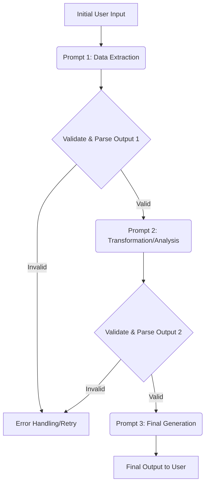

# 5.1 Prompt Chaining, Orchestration, and Pipelines

## The Problem: Monolithic Prompts and Complex Tasks

Complex Large Language Model (LLM) applications rarely rely on a single, monolithic prompt. Attempting to cram all instructions, context, and desired outputs into one prompt often leads to:

*   **Overwhelm:** The LLM struggles to manage too many disparate instructions.
*   **Inaccuracy:** Errors in one part of the task contaminate the entire output.
*   **Lack of Control:** Difficult to debug or refine specific aspects of the generation.
*   **Context Window Issues:** Large inputs and complex instructions quickly hit token limits.

To overcome these challenges, we decompose larger tasks into a series of smaller, more manageable sub-tasks, each handled by a dedicated prompt. This approach is known as **prompt chaining**, and the process of managing the flow, logic, and data between these prompts is called **orchestration**, forming an LLM **pipeline**.

## Core Concepts: Building Blocks of LLM Workflows

### 1. Prompt Chain

**Definition:** A sequence of individual prompts where the output of one prompt serves as the input or additional context for the next prompt in the series. This allows for multi-step reasoning, data transformation, and iterative refinement.

*   **Why it's necessary:** LLMs, while powerful, have limitations. They might struggle with highly complex, multi-faceted tasks in a single go. Chaining allows you to:
    *   **Decompose Complex Tasks:** Break down a large problem into smaller, more tractable sub-problems.
    *   **Improve Accuracy:** Each step can focus on a specific, simpler task, leading to more reliable outputs.
    *   **Manage Context:** Pass only relevant intermediate results, rather than the entire raw input, to subsequent steps.
    *   **Enable Specialized Roles:** Assign different personas or instructions to different stages of the pipeline.

### 2. Orchestration

**Definition:** The overarching logic and control flow that manages the execution of a prompt chain. This includes:

*   **Sequential Execution:** Running prompts one after another.
*   **Conditional Logic:** Deciding which prompt to execute next based on the output of a previous prompt (e.g., if sentiment is negative, then summarize negative feedback).
*   **Loops:** Iterating over a list of items, applying the same prompt to each.
*   **Parallel Execution:** Running multiple prompts simultaneously when their inputs are independent.
*   **Error Handling:** Managing unexpected or malformed outputs from an LLM.

### 3. Pipeline

**Definition:** A structured, end-to-end workflow that defines the sequence of prompts, the data flow between them, and the orchestration logic. Pipelines have clear inputs, intermediate steps, and a final output.

*   **Analogy:** Think of a software pipeline where data flows through different processing stages. In LLM pipelines, text and instructions are the data, and prompts are the processing units.

## Benefits of Prompt Chaining and Pipelines

*   **Improved Accuracy and Reliability:** By breaking down tasks, each LLM call is simpler and less prone to error.
*   **Modularity and Reusability:** Individual prompts become modular components that can be reused in different pipelines.
*   **Easier Debugging:** If an error occurs, it's easier to pinpoint which stage of the pipeline is responsible.
*   **Enhanced Control:** More granular control over the LLM's behavior at each step.
*   **Scalability:** Facilitates building complex applications that can handle diverse inputs and generate sophisticated outputs.

## Challenges in Chaining

*   **Error Propagation:** An error in an early stage can cascade and negatively impact subsequent stages. Robust error handling and validation are crucial.
*   **Context Management:** Ensuring that the right amount of relevant context is passed between stages without exceeding token limits.
*   **Latency:** Multiple LLM calls in sequence can increase overall response time.
*   **Output Parsing:** Reliably extracting structured information from one LLM's free-form text output to feed into the next prompt can be challenging.

## Visualizing a Prompt Pipeline

A clear pipeline structure is essential for understanding and managing complex LLM applications. Here's a Mermaid diagram illustrating a typical sequential prompt pipeline:



## Example Workflow: Summarizing and Extracting Key Information

**Scenario:** You have a long customer feedback document and want to:
1.  Summarize each section.
2.  Extract key complaints from the summaries.
3.  Generate a concise action plan based on the complaints.

**Pipeline Steps:**

### Step 1: Section Summarization (Prompt 1)

*   **Input:** A section of the customer feedback document.
*   **Prompt:**
    ```
    You are a summarization expert. Summarize the following section of customer feedback into 3-5 bullet points, focusing on key themes and issues.

    Section:
    """
    {section_text}
    """

    Summary:
    ```
*   **Output:** Bulleted summary of the section.

### Step 2: Complaint Extraction (Prompt 2)

*   **Input:** The bulleted summaries from Step 1 (concatenated).
*   **Prompt:**
    ```
    You are a data analyst. From the following summaries of customer feedback, extract all distinct complaints or negative issues. List each complaint as a separate item.

    Summaries:
    """
    {summaries_from_step_1}
    """

    Complaints:
    ```
*   **Output:** A list of extracted complaints.

### Step 3: Action Plan Generation (Prompt 3)

*   **Input:** The list of complaints from Step 2.
*   **Prompt:**
    ```
    You are a product manager. Based on the following customer complaints, propose a concise action plan with 3 actionable steps to address these issues.

    Complaints:
    """
    {complaints_from_step_2}
    """

    Action Plan:
    ```
*   **Output:** A 3-step action plan.

### Implementing Orchestration Logic (Conceptual Python)

While frameworks like LangChain simplify this, understanding the underlying logic is crucial. Here's how you might conceptually implement the above pipeline in Python, including basic conditional logic:

```python
import os
# from openai import OpenAI # Uncomment if you have OpenAI API key set up
# client = OpenAI()

def call_llm(prompt_content, model="gpt-3.5-turbo", temperature=0.7):
    """Simulates an LLM call for demonstration purposes."""
    print(f"\n--- LLM Call with Prompt ---\n{prompt_content}\n---")
    if "summarization expert" in prompt_content:
        return "Simulated Summary: - Key theme 1 - Key theme 2 - Key theme 3"
    elif "data analyst" in prompt_content:
        return "Simulated Complaints: Complaint A, Complaint B, Complaint C"
    elif "product manager" in prompt_content:
        return "Simulated Action Plan: 1. Action 1 2. Action 2 3. Action 3"
    else:
        return "Simulated LLM Response."

def run_customer_feedback_pipeline(feedback_document):
    print("Starting customer feedback pipeline...")

    # Step 1: Section Summarization
    section_text = feedback_document # In a real app, you'd chunk this
    prompt_summary = f"""
    You are a summarization expert. Summarize the following section of customer feedback into 3-5 bullet points, focusing on key themes and issues.

    Section:
    \"\"\"
    {section_text}
    \"\"\"

    Summary:
    """
    summaries = call_llm(prompt_summary)
    print(f"Step 1 Output (Summaries): {summaries}")

    # Conditional Logic Example: If summaries indicate negative sentiment, proceed to complaint extraction
    if "negative" in summaries.lower() or "complaint" in summaries.lower():
        print("Negative sentiment detected. Proceeding to complaint extraction.")
        # Step 2: Complaint Extraction
        prompt_complaints = f"""
        You are a data analyst. From the following summaries of customer feedback, extract all distinct complaints or negative issues. List each complaint as a separate item.

        Summaries:
        \"\"\"
        {summaries}
        \"\"\"

        Complaints:
        """
        complaints = call_llm(prompt_complaints)
        print(f"Step 2 Output (Complaints): {complaints}")

        # Step 3: Action Plan Generation
        prompt_action_plan = f"""
        You are a product manager. Based on the following customer complaints, propose a concise action plan with 3 actionable steps to address these issues.

        Complaints:
        \"\"\"
        {complaints}
        \"\"\"

        Action Plan:
        """
        action_plan = call_llm(prompt_action_plan)
        print(f"Step 3 Output (Action Plan): {action_plan}")
        return action_plan
    else:
        print("No significant negative sentiment detected. Skipping complaint extraction and action plan.")
        return "No action plan generated due to positive/neutral feedback."

# Example Usage:
sample_feedback = """
The new software update has significantly improved performance, but the user interface is still a bit clunky.
Many users reported issues with the login process after the last patch, leading to frustration.
However, the customer support team was very responsive and helpful in resolving the issues quickly.
"""
final_result = run_customer_feedback_pipeline(sample_feedback)
print(f"\nFinal Pipeline Result: {final_result}")

```

## Hands-On Exercise: Building a Simple Chained Pipeline

1.  **Choose a Multi-Part Task:** Select a task that naturally breaks into at least two distinct LLM calls. Example: "Extract key entities from a news article, then generate a short news headline based on those entities."
2.  **Prepare Input Data:** Find a short news article (e.g., 2-3 paragraphs).
3.  **Design Prompt 1 (Entity Extraction):**
    *   Prompt: `You are a data extractor. From the following news article, extract the main subject (person/organization), location, and any significant events. Format as a JSON object.

        Article:
        """
        {article_text}
        """

        Extracted Data:`
    *   Run this prompt in an LLM playground with your article.
    *   Carefully copy the JSON output.
4.  **Design Prompt 2 (Headline Generation):**
    *   Prompt: `You are a news editor. Write a concise and engaging news headline (under 10 words) based on the following extracted key information.

        Key Information:
        """
        {json_output_from_prompt_1}
        """

        Headline:`
    *   Paste the JSON output from Prompt 1 into the `{json_output_from_prompt_1}` placeholder.
    *   Run this prompt.
5.  **Review and Reflect:**
    *   Did the pipeline successfully achieve the overall goal?
    *   Was the output from Prompt 1 consistently formatted for Prompt 2? (This is a common challenge).
    *   How much manual intervention was required to pass data between steps?

## Tools and Frameworks for Orchestration

Manually chaining prompts can be cumbersome. Several frameworks are designed to simplify LLM orchestration:

*   **LangChain:** A popular framework for developing applications powered by LLMs. It provides abstractions for chains, agents, prompt templates, and integrations with various LLMs and external tools.
*   **LlamaIndex:** Focuses on data ingestion and retrieval for LLM applications, often used in conjunction with RAG pipelines.
*   **Semantic Kernel:** Microsoft's SDK for integrating LLMs with conventional programming languages, enabling "AI plugins" and chaining.
*   **Custom Code:** For simpler pipelines, direct scripting in Python or JavaScript can be sufficient.

These tools (covered in more detail in Chapter 7) provide programmatic ways to define, execute, and manage complex LLM workflows.

## Best Practices for Prompt Pipelines

*   **Modular Design:** Each prompt in the chain should have a single, clear responsibility.
*   **Clear Input/Output:** Define the expected input format for each prompt and the desired output format. Use structured outputs (e.g., JSON) whenever possible to simplify parsing.
*   **Robust Parsing:** Implement robust code to parse the output of one LLM call before feeding it to the next. Anticipate and handle malformed outputs.
*   **Error Handling:** Design your pipeline to gracefully handle errors or unexpected responses from any stage.
*   **Validation:** Validate intermediate outputs to ensure they meet expectations before proceeding to the next step.
*   **Token Management:** Be mindful of token usage across the entire pipeline. Summarize or filter intermediate results if necessary.
*   **Iterate and Test:** Build and test your pipeline incrementally. Debugging a multi-stage system can be complex.
*   **Observability:** Implement logging and monitoring to track the flow of data and outputs at each stage of the pipeline.
