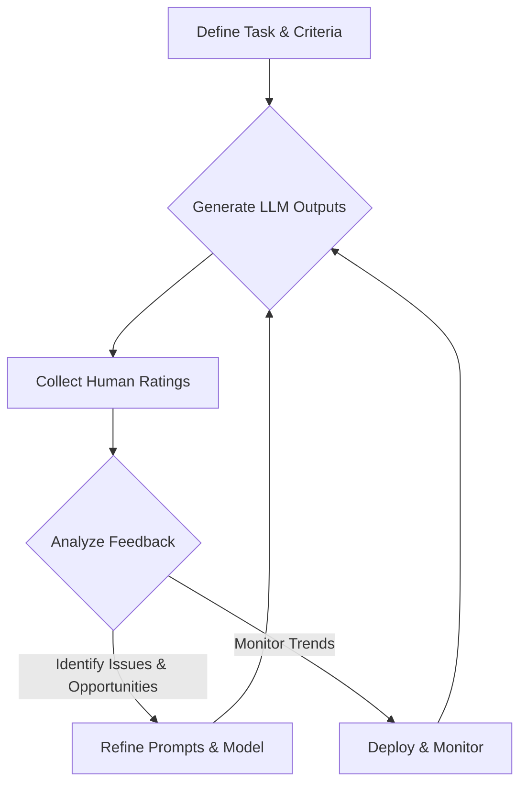

# 6.2 Human Evaluation: Criteria, Surveys, and Feedback Loops

While automated metrics (Chapter 6.1) provide quantitative insights, they often fall short in capturing the subjective nuances of human language, creativity, and real-world usefulness. For many prompt engineering tasks, especially those involving open-ended generation, complex reasoning, or user-facing applications, **human evaluation** remains the gold standard. This chapter explores how to define evaluation criteria, design effective surveys, and establish continuous feedback loops to iteratively improve LLM performance.

## Why Human Evaluation is Indispensable

*   **Subjective Quality:** Captures aspects like tone, style, creativity, and engagement that automated metrics cannot.
*   **Nuance and Context:** Humans can understand subtle contextual cues and implicit meanings that LLMs might miss.
*   **Real-World Usefulness:** Directly assesses whether the LLM's output is helpful, actionable, or appropriate for its intended purpose.
*   **Error Detection:** Identifies subtle errors, biases, or hallucinations that automated checks might overlook.
*   **Alignment with User Needs:** Ensures the LLM's behavior aligns with actual user expectations and preferences.

## Key Human Evaluation Criteria

The specific criteria will vary based on your application, but common ones include:

1.  **Fluency/Readability:** Is the generated text grammatically correct, natural-sounding, and easy to read?
2.  **Relevance:** Does the output directly address the user's query or the prompt's intent? Is it on-topic?
3.  **Accuracy/Factuality:** Is the information presented factually correct and free from hallucinations? (Crucial for factual tasks).
4.  **Coherence/Consistency:** Does the response flow logically? Is it internally consistent? Does it maintain consistency with previous turns in a conversation?
5.  **Completeness:** Does the response provide all necessary information to fulfill the request?
6.  **Conciseness:** Is the response brief and to the point, without unnecessary verbosity? (Important for summarization, extraction).
7.  **Usefulness/Helpfulness:** Would a human user find this output genuinely helpful or actionable in a real-world scenario?
8.  **Safety/Harmlessness:** Is the content free from bias, toxicity, hate speech, or other harmful outputs? (Critical for all applications).
9.  **Tone/Style Adherence:** Does the output match the requested tone (e.g., formal, friendly, witty) or style (e.g., journalistic, poetic)?
10. **Creativity/Novelty:** For generative tasks, is the output original, imaginative, and not repetitive?

## Designing Effective Human Evaluation Surveys

### 1. Define Clear Goals and Criteria

*   Before designing, clearly articulate *what* you want to measure and *why*. Which criteria are most important for your application's success?
*   Translate abstract criteria into concrete, measurable questions.

### 2. Select Appropriate Evaluators

*   **Internal Experts:** Subject matter experts, product managers, or prompt engineers. Provide high-quality, nuanced feedback but can be expensive and slow.
*   **Crowd-sourcing Platforms:** (e.g., Amazon Mechanical Turk, Appen, Scale AI). Cost-effective for large volumes but requires careful task design and quality control.
*   **End-Users:** Direct feedback from actual users of your application (e.g., thumbs up/down buttons, feedback forms). Provides invaluable real-world insights.

### 3. Choose Rating Scales and Question Types

*   **Likert Scales (e.g., 1-5):** For subjective criteria like fluency, relevance, usefulness.
    *   *Example:* "On a scale of 1 (Very Irrelevant) to 5 (Very Relevant), how relevant is this response to the question?"
*   **Binary Judgments (Yes/No):** For objective criteria or quick filtering.
    *   *Example:* "Is this response factually accurate? Yes/No."
    *   *Example:* "Would you use this response as is? Yes/No."
*   **Multiple Choice:** For classification tasks.
*   **Open-Ended Text Fields:** Crucial for collecting qualitative feedback, explanations for low ratings, and suggestions for improvement.

### 4. Structure the Questionnaire

*   **Clear Instructions:** Provide concise, unambiguous instructions for evaluators. Define each criterion clearly.
*   **Randomization:** Randomize the order of responses to prevent bias.
*   **Blind Evaluation:** If possible, hide which prompt version generated which output to prevent bias.
*   **Side-by-Side Comparison:** For A/B testing (Chapter 6.3), present two outputs side-by-side and ask evaluators to choose which is better or rate both.
*   **Context Provision:** Provide the original prompt and any relevant context (e.g., previous conversation turns) to the evaluators.
*   **Avoid Leading Questions:** Phrase questions neutrally.

### 5. Tools for Survey Creation

For small-scale internal evaluations or quick feedback, readily available tools like **Google Forms** or **SurveyMonkey** are sufficient. They allow for easy creation of questionnaires with various question types (Likert scales, multiple choice, open-ended).

For larger, more complex, or ongoing annotation tasks, consider **specialized annotation platforms** or **crowd-sourcing platforms**:

*   **Prodigy (Explosion AI):** A scriptable annotation tool that integrates directly with Python, ideal for developers and data scientists who want fine-grained control over their annotation workflows.
*   **Label Studio:** An open-source data labeling tool that supports various data types, including text, images, and audio, suitable for building custom annotation interfaces.
*   **Amazon Mechanical Turk (MTurk), Appen, Scale AI:** These crowd-sourcing platforms provide access to a large workforce for high-volume annotation tasks. They require careful task design, clear instructions, and robust quality control mechanisms to ensure reliable data.

**Example: Simple Human Evaluation Survey Structure (Conceptual Markdown)**

This is a conceptual outline of how you might structure a simple human evaluation survey. In a real scenario, you'd use a tool like Google Forms to build this.

```markdown
# LLM Output Evaluation Survey

Thank you for participating in this evaluation! Your feedback is crucial for improving our AI model.

**Instructions:**
*   You will be presented with a prompt and an AI-generated response.
*   Please evaluate the response based on the criteria below.
*   Be honest and provide constructive feedback in the comments section.

---

## Evaluation Item 1

**Original Prompt:**
"Write a short, engaging social media post announcing our new eco-friendly product line."

**AI-Generated Response:**
"🌿 Exciting news! Our new eco-friendly product line is here! Discover sustainable solutions for a greener future. #EcoFriendly #SustainableLiving"

### Criteria Ratings (Please select one for each)

**1. Relevance:** How well does the response address the prompt's intent?
    *   [ ] 1 - Very Irrelevant
    *   [ ] 2 - Somewhat Irrelevant
    *   [ ] 3 - Neutral
    *   [ ] 4 - Relevant
    *   [ ] 5 - Very Relevant

**2. Fluency/Readability:** Is the response grammatically correct, natural-sounding, and easy to read?
    *   [ ] 1 - Very Poor
    *   [ ] 2 - Poor
    *   [ ] 3 - Acceptable
    *   [ ] 4 - Good
    *   [ ] 5 - Excellent

**3. Engagement:** How engaging or appealing is the response for a social media audience?
    *   [ ] 1 - Not Engaging
    *   [ ] 2 - Slightly Engaging
    *   [ ] 3 - Moderately Engaging
    *   [ ] 4 - Engaging
    *   [ ] 5 - Very Engaging

**4. Conciseness:** Is the response brief and to the point, suitable for a social media post?
    *   [ ] 1 - Too Verbose
    *   [ ] 2 - Slightly Verbose
    *   [ ] 3 - Just Right
    *   [ ] 4 - Concise
    *   [ ] 5 - Very Concise

**Comments/Suggestions for Improvement (Optional):**
[                                                               ]
(Please provide specific examples or reasons for your ratings, especially for lower scores.)

---

## Evaluation Item 2
... (Repeat for additional items)
```

## The Human Feedback Loop: Continuous Improvement

Human evaluation is not a one-off activity but a continuous process integrated into the prompt engineering lifecycle. Think of it as a virtuous cycle that constantly refines your LLM's performance.



Here's a breakdown of the iterative feedback loop:

1.  **Collect Samples:** Generate a diverse set of LLM outputs using different prompts, inputs, and decoding parameters. Ensure these samples represent the variety of real-world scenarios your application will encounter.
2.  **Gather Ratings:** Distribute these samples to your chosen evaluators via well-designed surveys or annotation tasks. Emphasize clear instructions and consistent application of criteria.
3.  **Analyze Results:** This is a critical step where raw data transforms into actionable insights.
    *   **Quantitative Analysis:** Calculate average scores for each criterion, identify trends, and compare performance across different prompt versions. Look for statistically significant differences (linking to Chapter 6.3).
    *   **Qualitative Analysis:** Dive deep into open-ended comments. Look for recurring themes, specific examples of good/bad outputs, and actionable suggestions. This often reveals *why* certain outputs are preferred or problematic.
    *   **Error Categorization:** Classify specific types of errors (e.g., hallucination, off-topic, formatting error, safety violation) to pinpoint systemic issues that can be addressed through prompt improvement or model fine-tuning.
4.  **Iterate Prompts:** Based on the analysis, refine your prompts. This might involve:
    *   Adjusting instructions for clarity and specificity.
    *   Adding/modifying few-shot examples to guide the model better.
    *   Changing roles or constraints to align with desired behavior.
    *   Implementing new prompt patterns (e.g., Chain-of-Thought, RAG) to improve reasoning or factual grounding.
    *   Adjusting decoding parameters (temperature, top-p) to control creativity vs. determinism.
5.  **Re-evaluate:** Test the refined prompts with a new, unseen set of samples and repeat the evaluation process. This validates whether your changes truly led to improvement.

## Hands-On Exercise: Conducting a Mini Human Evaluation

1.  **Choose a Generative Task:** Select a task where automated metrics are insufficient, such as generating creative headlines for a product or writing short social media posts.
2.  **Generate Outputs:**
    *   Craft two different prompt versions for the same task (e.g., one simple, one with a role and constraints).
    *   Generate 5-10 outputs for each prompt version using the same input.
3.  **Design a Simple Survey:**
    *   Use Google Forms or a similar tool.
    *   For each generated output, include:
        *   The original prompt and input.
        *   Rating questions (e.g., 1-5 for "Creativity," "Relevance," "Readability").
        *   An open-ended text box for "Comments/Suggestions."
    *   Crucially, *do not* reveal which prompt version generated which output.
4.  **Gather Feedback:** Invite 3-5 friends or colleagues to complete the survey.
5.  **Analyze and Reflect:**
    *   Calculate average scores for each prompt version across all criteria.
    *   Read all qualitative comments. What common themes emerge?
    *   Which prompt version performed better according to human judgment? Why?
    *   Based on the feedback, what specific changes would you make to your prompts?

## Challenges and Considerations for Human Evaluation

While indispensable, human evaluation comes with its own set of challenges that prompt engineers must navigate:

*   **Cost:** Human evaluation can be significantly more expensive than automated metrics, especially for large-scale evaluations or when requiring highly specialized expert annotators.
*   **Time-Consuming:** Collecting and analyzing human feedback is inherently slower than running automated scripts. This can impact the speed of your iterative prompt development cycle.
*   **Subjectivity and Variability:** Human judgments are subjective and can vary significantly between different annotators. What one person considers "fluent," another might find "acceptable." This variability necessitates clear guidelines and mechanisms to ensure consistency.
*   **Scalability:** It's difficult to scale human evaluation to the same extent as automated metrics. You can't easily run millions of human evaluations overnight.
*   **Evaluator Bias:** Annotators can introduce their own biases (conscious or unconscious) based on their background, preferences, or even fatigue.
*   **Task Complexity:** For very complex tasks, it can be challenging to define clear, unambiguous criteria that all evaluators can consistently apply.

## Common Pitfalls in Human Evaluation

To avoid common missteps and ensure your human evaluation efforts yield reliable and actionable insights, be aware of these pitfalls:

*   **Unclear Instructions:** Vague or ambiguous instructions lead to inconsistent ratings and unreliable data. Always define criteria precisely and provide examples.
*   **Insufficient Training:** Don't assume evaluators inherently understand your criteria. Provide training, calibration sessions, and opportunities for questions.
*   **Lack of Inter-Annotator Agreement (IAA) Checks:** Without measuring IAA, you can't be sure your evaluators are applying criteria consistently. Low IAA indicates a problem with your guidelines, training, or the task itself.
*   **Evaluator Fatigue:** Long or repetitive tasks can lead to fatigue, reducing the quality and consistency of ratings. Break tasks into smaller chunks and provide breaks.
*   **Order Bias:** The order in which outputs are presented can influence ratings. Always randomize the presentation order.
*   **Confirmation Bias:** If evaluators know which prompt version generated which output, they might unconsciously favor the version they expect to be better. Blind evaluation is crucial.
*   **Ignoring Qualitative Feedback:** Focusing solely on numerical ratings and neglecting open-ended comments means missing rich, actionable insights into *why* certain outputs perform as they do.
*   **Infrequent Evaluation:** Treating human evaluation as a one-off event rather than an ongoing feedback loop will hinder continuous improvement.

## Hybrid Evaluation Strategies: Combining Human and Automated Approaches

The most effective prompt evaluation strategies often combine the strengths of both automated and human metrics. This hybrid approach allows for scalable, objective measurement while retaining the nuanced understanding of human judgment.

*   **Automated Filtering & Prioritization:** Use automated metrics (BLEU, ROUGE, Embedding Similarity) to quickly filter out clearly poor outputs or to identify promising prompt variants for further human review. This saves significant time and cost.
*   **Targeted Human Review:** Focus human evaluation efforts on:
    *   Outputs that automated metrics flag as borderline or ambiguous.
    *   Tasks where subjective quality (creativity, tone) is paramount.
    *   Critical use cases where factual accuracy or safety is non-negotiable.
    *   New prompt patterns or model capabilities where automated metrics might not yet be well-calibrated.
*   **Calibration and Validation:** Use human evaluation to calibrate and validate your automated metrics. If an automated metric consistently disagrees with human judgment, it might not be the right metric for your specific task or needs adjustment.
*   **Continuous Feedback Loop:** Integrate both types of evaluation into a continuous feedback loop. Automated metrics can provide real-time monitoring in production, while periodic human evaluations ensure alignment with evolving user expectations and detect subtle issues.

By strategically combining automated and human evaluation, prompt engineers can achieve a robust, efficient, and comprehensive assessment of LLM performance, leading to more effective and reliable AI applications.
