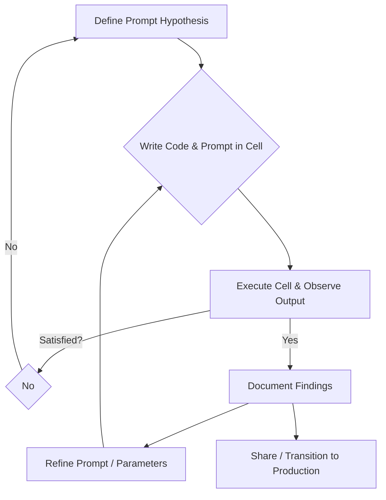

# 7.2 Notebook-Based Experimentation: The Prompt Engineer's Iterative Workbench

Rapid iteration is paramount in Large Language Model (LLM) development. Prompt engineers require an environment that facilitates quick idea testing, immediate result observation, and prompt refinement without the typical overhead of traditional software development. This need is precisely why interactive computing environments, especially **Jupyter Notebooks** (including JupyterLab, Google Colab, and VS Code Notebooks), have become the indispensable workbench for prompt engineering.

This chapter details why notebooks are crucial for prompt engineering, guides you through setting up your environment, and demonstrates practical techniques for comparing prompt variants and visualizing their impact.

## Why Notebooks are Indispensable for Prompt Engineering

Notebooks offer a unique combination of executable code, rich text, and visual output, making them exceptionally well-suited for the iterative and experimental nature of prompt engineering:

1.  **Interactivity and Rapid Iteration:** Notebooks enable a highly interactive workflow crucial for prompt engineering.
    *   **Cell-by-Cell Execution:** Execute code in small, manageable blocks, providing immediate feedback on prompt changes or parameter adjustments. This accelerates hypothesis testing.
    *   **On-the-Fly Modification:** Directly modify prompts, LLM parameters (e.g., `temperature`, `max_tokens`), or input data within a cell and re-run it instantly. This "try-and-see" approach significantly speeds up prompt tuning.
    *   **State Preservation:** Maintain execution state across cells, allowing you to run expensive data loading or model initialization once, then rapidly iterate on prompts without re-running everything.
2.  **Visualization and Exploration:** Gain immediate insights into LLM behavior.
    *   **Rich Outputs:** Embed charts, tables, images, and interactive HTML directly alongside code and explanations. This facilitates visual inspection of LLM outputs, comparison of responses, and analysis of data distributions.
    *   **Evaluation Insights:** Easily plot evaluation metrics (Chapter 6.1) or visualize trends in human ratings (Chapter 6.2) to understand prompt performance.
3.  **Documentation and Reproducibility:** Notebooks serve as living, executable records of your work.
    *   **Living Documents:** Combine executable code, markdown text (for explanations, hypotheses, and observations), and actual outputs in a single, cohesive document. This creates a living record of experiments and findings.
    *   **Experiment Trails:** A well-structured notebook documents the entire thought process and evolution of a prompt, aiding reproducibility and knowledge transfer within a team.
4.  **Shareability and Collaboration:** Facilitate seamless sharing and teamwork.
    *   **Standard Format:** Notebook files (`.ipynb`) are a standard format, easily shareable across different environments and platforms.
    *   **Collaborative Platforms:** Platforms like Google Colab, Deepnote, or shared JupyterHub instances enable real-time collaborative editing, making it easy for teams to work on prompts together.
    *   **Web Rendering:** Tools like GitHub's `nbviewer` or VS Code's built-in renderer allow notebooks to be viewed directly in web browsers, simplifying result sharing with non-technical stakeholders.
5.  **Prototyping Complex Workflows:** Build and test intricate LLM applications iteratively.
    *   **Modular Development:** Notebooks are ideal for prototyping complex LLM workflows, such as multi-step prompt chains, Retrieval-Augmented Generation (RAG) pipelines, or agentic behaviors involving external tools. Build and test each component iteratively before integration.
    *   **Transition to Production:** Once a prototype is validated in a notebook, its modular code can often be refactored and ported to more robust production-ready `.py` scripts.

## The Notebook Experimentation Loop (Conceptual)



## Real-World Applications of Notebooks in Prompt Engineering

Notebooks are not just for learning; they are actively used in professional prompt engineering workflows:

*   **Rapid Prototype Development:** Data scientists and prompt engineers use notebooks to quickly build and test initial versions of LLM-powered features, such as a summarization tool, a content classifier, or a simple chatbot.
*   **Prompt Optimization and A/B Testing:** Before deploying a prompt to production, notebooks are used to run systematic experiments (like A/B tests, as discussed in Chapter 6.3) comparing different prompt variants, analyzing their outputs, and visualizing performance metrics.
*   **Data Exploration for RAG:** When building Retrieval-Augmented Generation (RAG) systems, notebooks are invaluable for exploring source documents, experimenting with different chunking strategies, and testing retrieval mechanisms before integrating them into a larger application.
*   **Agent Behavior Development:** For complex agents that use multiple tools, notebooks allow developers to step through the agent's reasoning process, inspect intermediate thoughts and tool calls, and debug unexpected behaviors.
*   **Ad-hoc Analysis and Troubleshooting:** When a production LLM application encounters an issue (e.g., a sudden drop in quality or an increase in hallucinations), notebooks are often the first place engineers go to load problematic inputs, re-run them with different prompts, and diagnose the root cause.
*   **Demonstrations and Presentations:** Notebooks serve as excellent tools for demonstrating LLM capabilities and prompt engineering techniques to stakeholders, product managers, or other team members, as they combine live code with explanations and results.

## Example Setup: Your First Prompt in a Notebook

1.  **Create a New Notebook:** Open JupyterLab, Google Colab, or a new VS Code Notebook.
2.  **Install Necessary SDKs:** Run the following in a notebook cell (using `!` for shell commands). This ensures all required libraries are available.
    ```bash
    !pip install openai langchain-openai pandas matplotlib seaborn tiktoken
    ```
3.  **Initialize LLM Client and Test a Basic Prompt:**
    ```python
    import os
    from openai import OpenAI
    from langchain_openai import ChatOpenAI
    import pandas as pd
    import matplotlib.pyplot as plt
    import seaborn as sns

    # Security Best Practice: Always load API keys from environment variables
    # For example, set OPENAI_API_KEY in your shell before launching Jupyter:
    # export OPENAI_API_KEY='your_key_here'
    # Avoid hardcoding keys directly in your notebook, especially for production.

    # Initialize OpenAI client for direct API calls
    client = OpenAI()

    # Initialize LangChain LLM for consistency with later examples using frameworks
    llm_langchain = ChatOpenAI(model_name="gpt-3.5-turbo", temperature=0.7)

    # Test a simple prompt using the OpenAI SDK
    prompt_text_openai = "Explain the concept of prompt engineering in one concise sentence."
    response_openai = client.chat.completions.create(
        model="gpt-3.5-turbo",
        messages=[{"role": "user", "content": prompt_text_openai}]
    )
    print("--- OpenAI SDK Response ---")
    print(response_openai.choices[0].message.content)

    # Test the same prompt using LangChain
    prompt_text_langchain = "Explain the concept of large language models in one concise sentence."
    langchain_response = llm_langchain.invoke(prompt_text_langchain)
    print("\n--- LangChain Response ---")
    print(langchain_response.content)
    ```

## Hands-On Exercise: Comparing Prompt Variants in a Notebook

This exercise demonstrates how to systematically compare different prompt variants and visualize their outputs.

1.  **Define a Wrapper Function for LLM Calls:**
    ```python
    def get_llm_response_with_params(prompt_content, model="gpt-3.5-turbo", temperature=0.7, max_tokens=100):
        try:
            response = client.chat.completions.create(
                model=model,
                messages=[{"role": "user", "content": prompt_content}],
                temperature=temperature,
                max_tokens=max_tokens
            )
            return response.choices[0].message.content.strip()
        except Exception as e:
            return f"Error: {e}"
    ```
2.  **Create a DataFrame of Prompt Variants:**
    ```python
    # Scenario: Summarizing a product review for different audiences/tones
    review_text = "The new XYZ speaker has amazing sound quality, but the battery life is disappointingly short, only lasting about 4 hours."

    prompt_variants = [
        {
            "name": "Concise Summary",
            "prompt_template": "Summarize the following review concisely: \"\"\"{review}\"\"\"",
            "temperature": 0.3
        },
        {
            "name": "Marketing Summary",
            "prompt_template": "You are a marketing expert. Write a positive summary of the following review, highlighting strengths and downplaying weaknesses: \"\"\"{review}\"\"\"",
            "temperature": 0.7
        },
        {
            "name": "Technical Summary",
            "prompt_template": "Summarize the technical aspects of the following review, focusing on performance metrics: \"\"\"{review}\"\"\"",
            "temperature": 0.2
        }
    ]

    results_df = pd.DataFrame(prompt_variants)
    results_df['input_review'] = review_text
    ```
3.  **Generate Outputs and Store in DataFrame:**
    ```python
    # Apply the LLM call function to each prompt variant
    results_df['generated_output'] = results_df.apply(
        lambda row: get_llm_response_with_params(
            prompt_content=row['prompt_template'].format(review=row['input_review']),
            temperature=row['temperature']
        ),
        axis=1
    )

    # Display results side-by-side
    pd.set_option('display.max_colwidth', None) # Display full content
    print(results_df[['name', 'prompt_template', 'generated_output']])
    ```
4.  **Add Simple Evaluation (e.g., Length):**

    To estimate token length accurately, install `tiktoken`:
    ```bash
    !pip install tiktoken
    ```
    ```python
    import tiktoken # Import the tokenizer library

    # Get the tokenizer for the specific model (e.g., gpt-3.5-turbo)
    encoding = tiktoken.encoding_for_model("gpt-3.5-turbo")

    results_df['output_length_tokens'] = results_df['generated_output'].apply(
        lambda x: len(encoding.encode(x)) # Use tiktoken for accurate token estimation
    )
    print("\nResults with Output Length:")
    print(results_df[['name', 'output_length_tokens', 'generated_output']])
    ```

## Visualization: Analyzing Prompt Impact

Notebooks excel at visualizing data. You can plot relationships between prompt parameters and output characteristics.

```python
# Example: Plotting output length vs. temperature (conceptual data)
# Assuming results_df has 'temperature' and 'output_length_tokens' columns
# For a real plot, you'd run more experiments with varying temperatures.

# Create some dummy data for demonstration if your results_df is small
if len(results_df) < 5:
    dummy_data = {
        'temperature': [0.1, 0.5, 0.9, 1.2, 1.5],
        'output_length_tokens': [50, 70, 90, 110, 130],
        'name': ['T0.1', 'T0.5', 'T0.9', 'T1.2', 'T1.5']
    }
    dummy_df = pd.DataFrame(dummy_data)
    # Combine with actual results for a richer plot if desired
    plot_df = pd.concat([results_df[['temperature', 'output_length_tokens', 'name']], dummy_df])
else:
    plot_df = results_df[['temperature', 'output_length_tokens', 'name']]


plt.figure(figsize=(8, 5))
sns.scatterplot(data=plot_df, x='temperature', y='output_length_tokens', hue='name', s=100)
plt.title('Output Length vs. Temperature')
plt.xlabel('Temperature')
plt.ylabel('Output Length (Tokens)')
plt.grid(True)
plt.show()
```

## Advanced Notebook Techniques

Beyond basic cell execution, notebooks offer advanced features that can significantly enhance your prompt engineering workflow:

*   **Widgets for Interactive Exploration:** Use `ipywidgets` to create interactive sliders, dropdowns, text input fields, and buttons directly within your notebook. This allows non-coders or stakeholders to easily experiment with different prompt parameters or input values without modifying code, fostering collaboration and rapid feedback.
*   **Logging and MLOps Integrations:** Integrate your notebook experiments with MLOps platforms like Weights & Biases Prompts, MLflow, or LangSmith (Chapter 7.3). These integrations allow you to automatically log prompt inputs, LLM outputs, model parameters, and evaluation metrics, providing a centralized system for tracking, comparing, and reproducing experiments.
*   **Version Control Best Practices:** Git is essential for versioning your notebooks. However, large outputs embedded in `.ipynb` files can bloat repositories. Use tools like `nbstripout` to automatically clear outputs before committing, or leverage platforms that handle notebook versioning more intelligently.
*   **Programmatic Parameter Sweeps:** Instead of manually changing parameters, write code to programmatically run experiments across a grid of prompt parameters (e.g., different temperatures, top-p values, or few-shot examples). Collect and analyze results in a structured DataFrame for systematic optimization.
*   **Progress Bars for Long Operations:** For operations involving many LLM calls or data processing steps, use libraries like `tqdm` to display progress bars. This provides visual feedback and helps estimate completion time, especially in long-running cells.

    ```python
    from tqdm.notebook import tqdm # Use tqdm.notebook for Jupyter/Colab integration

    # Example: Simulating multiple LLM calls with a progress bar
    # (Replace with your actual LLM call logic)
    prompts_to_process = [f"Generate a creative idea for {i}" for i in range(20)]
    results = []
    for prompt in tqdm(prompts_to_process, desc="Processing Prompts"):
        # Simulate LLM call
        # response = get_llm_response_with_params(prompt)
        # results.append(response)
        import time
        time.sleep(0.1) # Simulate work
        results.append(f"Response for: {prompt}")
    print("\nFinished processing all prompts.")
    ```

## Key Questions for Practice

*   How does the interactive nature of notebooks accelerate prompt tuning compared to traditional script-based development?
*   What are the most effective ways to compare generated outputs side-by-side in a DataFrame for your specific use cases?
*   Which types of visualizations would provide the most valuable insights for your prompt engineering tasks (e.g., comparing accuracy across different few-shot examples, analyzing response diversity)?
*   What steps can you take to ensure your notebook experiments are reproducible and easily shareable with colleagues?

## Best Practices for Notebook-Based Prompt Engineering

*   **Organize Cells Logically:** Group imports, setup, prompt definitions, and execution cells for clarity.
*   **Document Thoroughly:** Use Markdown cells to explain your hypotheses, experiments, and observations, creating a narrative for your work.
*   **Clear Outputs:** Ensure outputs are easy to read and interpret. Use `print()` statements or `display()` for structured presentation.
*   **Manage API Keys Securely:** Never hardcode API keys directly in your notebook. Always use environment variables or secure credential management systems.
*   **Version Control:** Commit your notebooks regularly. Utilize tools like `nbstripout` to clear outputs before committing to prevent repository bloat.
*   **Modularize Code:** As experiments grow in complexity, refactor reusable functions into separate Python files and import them into your notebook.
*   **Transition to Production:** Remember that notebooks are primarily for experimentation and prototyping. Production code should typically reside in `.py` scripts, often leveraging the same SDKs and frameworks validated in the notebook.
*   **Clean Up:** Clear all cell outputs before saving and sharing to reduce file size and improve readability.

## Summary

Notebooks are an indispensable tool for prompt engineers, offering an interactive, iterative, and highly visual environment for developing and refining LLM prompts. Their ability to combine code, text, and rich outputs in a single document makes them ideal for rapid experimentation, detailed documentation, and collaborative workflows. By following best practices for organization, security, and version control, prompt engineers can leverage notebooks to accelerate their development cycles and transition successful prototypes into robust production applications.
