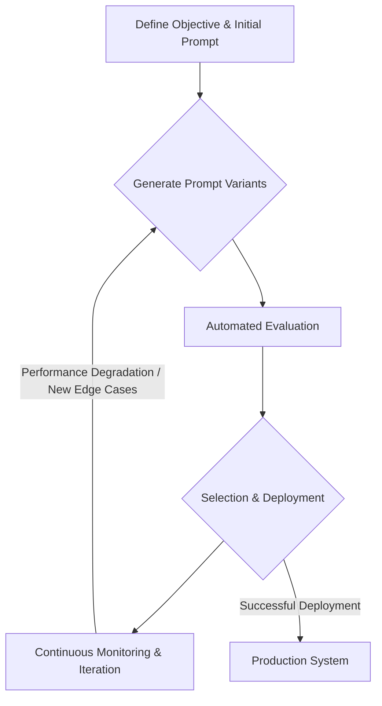

# 13.2 Self-Improving & Autonomous Systems

The evolution of AI is rapidly moving towards systems that can autonomously refine their own prompts and underlying models. This chapter delves into the concept of self-improving and autonomous AI agents, exploring how they close the loop between real-world usage and continuous system enhancement, leading to more robust, adaptive, and efficient AI applications.

## Key Concepts

-   **Self-Improvement Loop:** This refers to an iterative process where AI agents automatically generate, evaluate, and refine their own prompts or internal models. The loop typically involves proposing new prompt variations, testing them against defined criteria, and then updating the system based on performance metrics.
-   **Meta-Learning:** Also known as "learning to learn," meta-learning enables models to adapt quickly to new tasks or environments with limited new data. In the context of prompting, this means an AI can learn general strategies for prompt optimization rather than just optimizing for a single task.
-   **Automated Feedback:** This involves continuous monitoring of an AI system's performance in real-world scenarios. The insights gained from this monitoring (e.g., accuracy, user satisfaction, error rates) are automatically fed back into the system to trigger prompt adjustments or model fine-tuning.
-   **Human–Agent Collaboration:** While systems become more autonomous, human oversight remains crucial. Humans typically define the high-level objectives, ethical boundaries, and safety guardrails, while the AI agent handles the iterative optimization within these predefined constraints.

## Mechanisms for Self-Improvement

-   **Reinforcement Learning (RL):** Agents can learn to optimize prompts by receiving rewards based on the quality of their outputs. For example, a prompt generating a more accurate summary might receive a higher reward, reinforcing the underlying prompt structure. *Example: An agent tries different prompt variations for a chatbot. If a user rates a response highly, the prompt that generated it receives a positive reward, making it more likely to be used or refined.*
-   **Evolutionary Algorithms:** These algorithms can generate diverse prompt variations and select the fittest ones based on performance metrics, mimicking natural selection to evolve optimal prompts over time. *Example: A population of prompts for code generation is created. Prompts that produce more functional or efficient code are "bred" to create new generations of prompts.*
-   **Automated Prompt Generation:** Using meta-prompts, an LLM can be instructed to generate new prompts or modify existing ones based on a given task description or performance feedback. *Example: A meta-prompt asks an LLM to "Improve this prompt for generating product descriptions to be more concise and persuasive," and the LLM outputs several refined versions.*
-   **Active Learning:** The system identifies instances where it is uncertain or performing poorly and actively seeks human feedback or additional data to improve its prompt or model. *Example: A medical diagnosis AI flags cases where its confidence score is low and routes them to a human expert for review and correction, using that feedback to refine its prompts.*

## Example Workflow

The self-improvement loop can be visualized as follows:



1.  **Define Objective & Initial Prompt:**
    *   Clearly state the task (e.g., "Translate technical documentation from English to German with high accuracy").
    *   Provide an initial prompt template.
2.  **Generate Prompt Variants:**
    *   An autonomous agent (or a meta-prompted LLM) proposes several new prompt templates or modifications to the existing one. These variants might explore different phrasing, few-shot examples, or structural changes.
3.  **Automated Evaluation:**
    *   Each prompt variant is programmatically tested against a diverse, held-out dataset of inputs.
    *   Performance is measured using automated metrics (e.g., BLEU score for translation, F1-score for classification) or simulated user feedback.
4.  **Selection & Deployment:**
    *   The variant with the highest performance score is automatically selected.
    *   This optimized prompt is then deployed to a staging or production environment.
5.  **Continuous Monitoring & Iteration:**
    *   Live metrics (e.g., latency, output quality, user engagement) are continuously tracked.
    *   If performance degrades or new edge cases are detected, the self-improvement loop is re-triggered to generate and evaluate new prompt variants.

## Hands-On Exercise

1.  **Meta-Prompting for Prompt Refinement:**
    *   Choose a specific task (e.g., generating marketing copy, summarizing news articles).
    *   Write an initial prompt for this task.
    *   Craft a "meta-prompt" that instructs an LLM to analyze your initial prompt and suggest 3-5 improved versions, explaining the rationale for each improvement.

    **Example:**
    *   **Initial Prompt:** "Write a short email to announce a new software update."
    *   **Meta-Prompt:**
        ```
        Analyze the following prompt and suggest 3 improved versions. For each suggestion, explain why it's an improvement, focusing on clarity, conciseness, and effectiveness for generating marketing emails.

        Original Prompt: "Write a short email to announce a new software update."
        ```
    *   **Expected LLM Output (Example):**
        ```
        Suggestion 1:
        Prompt: "Draft a concise, engaging email announcing our latest software update. Highlight key new features and a clear call to action to download/learn more. Target audience: existing users."
        Rationale: This version adds specificity regarding engagement, key features, call to action, and target audience, leading to more focused output.

        Suggestion 2:
        Prompt: "Compose a brief email to inform users about a critical software update. Emphasize security enhancements and the immediate need to update. Subject line should convey urgency."
        Rationale: This prompt introduces a specific purpose (critical update, security) and a directive for the subject line, guiding the tone and content.
        ```

2.  **Programmatic Evaluation Simulation:**
    *   For the task chosen above, create a small dataset of 10-20 input examples and their desired outputs (ground truth).
    *   Using a scripting language (e.g., Python), iterate through the original prompt and the LLM-suggested prompt variants.
    *   For each prompt, send the input to an LLM API, receive the output, and compare it to your ground truth. Implement a simple scoring mechanism (e.g., keyword matching, semantic similarity using embeddings).
    *   Identify which prompt variant performed best based on your scoring.

    **Code Snippet (Conceptual - using a hypothetical LLM API):**
    ```python
    import requests
    # from sklearn.metrics.pairwise import cosine_similarity # For semantic similarity
    # from transformers import AutoTokenizer, AutoModel # For embeddings

    # Replace with your actual API key and endpoint
    API_KEY = "YOUR_LLM_API_KEY"
    API_ENDPOINT = "https://api.example.com/llm/generate"

    def call_llm(prompt_text, input_data):
        headers = {"Authorization": f"Bearer {API_KEY}"}
        payload = {"prompt": prompt_text + "\n\nInput: " + input_data}
        response = requests.post(API_ENDPOINT, json=payload, headers=headers)
        response.raise_for_status()
        return response.json().get("generated_text", "")

    def simple_keyword_score(generated_text, ground_truth_keywords):
        score = 0
        for keyword in ground_truth_keywords:
            if keyword.lower() in generated_text.lower():
                score += 1
        return score

    # Example Dataset (simplified)
    evaluation_data = [
        {"input": "New feature: Dark Mode", "ground_truth_keywords": ["dark mode", "new feature", "visuals"]},
        {"input": "Bug fix: Login issue", "ground_truth_keywords": ["bug fix", "login", "stability"]},
    ]

    prompts_to_evaluate = {
        "original": "Write an announcement for a software update based on the input.",
        "improved_1": "Draft a concise, engaging email announcing our latest software update. Highlight key new features and a clear call to action to download/learn more. Target audience: existing users. Input: ",
        # Add more improved prompts here
    }

    results = {}
    for prompt_name, prompt_template in prompts_to_evaluate.items():
        total_score = 0
        for item in evaluation_data:
            generated_output = call_llm(prompt_template, item["input"])
            score = simple_keyword_score(generated_output, item["ground_truth_keywords"])
            total_score += score
            print(f"Prompt: {prompt_name}, Input: {item['input']}, Output: {generated_output}, Score: {score}")
        results[prompt_name] = total_score
    
    print("\n--- Evaluation Results ---")
    for prompt_name, score in results.items():
        print(f"Prompt '{prompt_name}': Total Score = {score}")

    best_prompt = max(results, key=results.get)
    print(f"\nBest performing prompt: {best_prompt}")
    ```

3.  **Experiment Tracking (Conceptual):**
    *   Outline how you would integrate this process with an experiment tracking tool (e.g., MLflow, Weights & Biases). What metrics would you log? How would you track prompt versions?

    **Considerations:**
    *   **Metrics to Log:** Performance scores (e.g., BLEU, F1, custom keyword scores), latency, token usage, number of human interventions.
    *   **Tracking Prompt Versions:** Store prompt text, meta-prompts used for generation, and any associated metadata (e.g., author, date, task). Use a version control system (like Git) for prompts themselves, and link commits to experiment runs.
    *   **Run Metadata:** Log parameters like LLM model used, temperature, top-k/top-p settings, dataset version.
    *   **Artifacts:** Save generated outputs, evaluation reports, and any intermediate data.

## Reflection

-   How did the autonomously generated prompts compare to your initial manual prompt? Were there unexpected improvements or regressions?
-   What are the primary risks associated with allowing AI agents to self-optimize without continuous human oversight? How might these risks manifest in real-world applications?
-   What specific safeguards or human-in-the-loop mechanisms would you implement to ensure the reliable and ethical self-improvement of autonomous prompting systems?
-   Discuss the computational and data requirements for truly effective self-improving systems. How might these factors limit their current widespread adoption?
